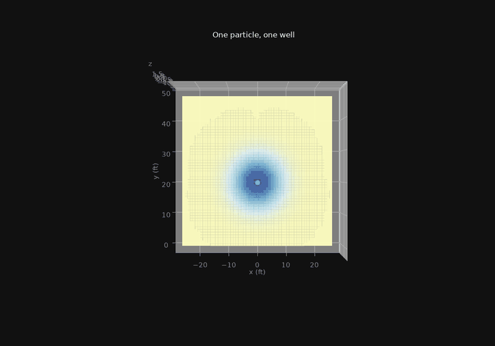

# Court Gravity

3Blue1Brown-style visualization of basketball players as gravity wells on the court plane.

[](https://court-gravity.onrender.com)

**Live web toy:** [court-gravity.onrender.com](https://court-gravity.onrender.com)  
**Repo:** [github.com/KobaKhit/court-gravity](https://github.com/KobaKhit/court-gravity)

Shared **NumPy field core** feeds:

- **Manim Community** explainer (`manim_video/`)
- **Three.js + R3F + leva** interactive web toy (`web/`)
- Timed **Edge TTS narration** aligned to Manim section windows
- Optional **Blender** displacement bake (`blender/`)

Offense digs attractive wells (negative \(z\)); defense raises repulsive ridges (positive \(z\)).

> Pedagogical model inspired by Fernández & Bornn pitch control and NBA “Gravity” framing — **not** a reproduction of the proprietary NBA Gravity metric.

## Quick start

### Python core

```bash
cd court-gravity
python -m venv .venv
# Windows:
.venv\Scripts\activate
pip install -e ".[dev]"

python scripts/sanity_plot.py
python scripts/parity_check.py
python scripts/generate_data.py
pytest
```

### Web

```bash
cd web
npm install
npm run dev
```

Open the local Vite URL. Use leva controls for `threePct`, `defense`, `sigma`, `mode` (`net` / `offense` / `defense`), kernel toggle, animation, and marble.

### Manim explainer

Manim Community needs compatible `moderngl` wheels (Python 3.11/3.12 recommended on Windows):

```bash
py -3.12 -m venv .venv-manim
.venv-manim\Scripts\python.exe -m pip install -e ".[video,dev,preview]"
.venv-manim\Scripts\manim.exe -ql manim_video/full_explainer.py CourtGravityExplainer
# copy draft → data/storyboard/court_gravity_manim_draft.mp4
```

Other scenes (lab / demos, not the production film):

```bash
manim -ql manim_video/scenes.py GravityCourtStatic
manim -ql manim_video/storyboard.py MassModulation
```

Use `-qh --fps 30` for the website cut (or `-qk --renderer=opengl` for a higher-quality local review).

Without Manim, use the matplotlib / Pillow **abbreviated 6-beat** preview (story reel only — not the 12-chapter film):

```bash
python manim_video/render_matplotlib.py
# regenerable frames → data/storyboard/ (gitignored)

pip install -e ".[preview]"
python manim_video/render_explainer_preview.py
# GIF → data/storyboard/court_gravity_explainer_preview.gif
```

### Narration (timed VO)

The long-form essay in `manim_video/NARRATION.md` is denser than the ~4-minute draft. Production voiceover uses condensed `spoken` lines in `manim_video/narration_cues.json`, timed to Manim section windows from `full_explainer.py`.

```bash
pip install -e ".[narration]"
python scripts/build_narration.py analyze
# Prefer reusing expensive ElevenLabs/Edge mp3 sources:
python scripts/build_narration.py synthesize --reuse-clips
python scripts/build_narration.py mux
# Review frames / glyph leaks:
python scripts/review_explainer_frames.py --video data/storyboard/court_gravity_manim_draft.mp4
```

Default Edge voice is `en-US-AndrewNeural` at `-5%`. Alternatives: `--voice en-US-BrianNeural` or `--voice en-US-ChristopherNeural`.

**ElevenLabs (best quality)** — requires CLI + API key:

```bash
# one-time: elevenlabs config init --api-key sk_...
python scripts/build_narration.py all --engine elevenlabs --voice Daniel
# calmer US options: --voice Adam   or   --voice George
```

Outputs (gitignored):

- `data/storyboard/narration/clips/*.mp3` (preserve these)
- `data/storyboard/narration/court_gravity_narration.wav`
- `data/storyboard/narration/court_gravity_with_narration.mp4`
- `data/storyboard/review/` contact sheets

After mux, copy the narrated file to `web/public/videos/court_gravity_explainer.mp4` for the site.

Optional OpenAI voices:

```bash
set OPENAI_API_KEY=...
python scripts/build_narration.py synthesize --engine openai --voice verse
```

## Ship / deploy

```bash
python scripts/ship.py
# generate_data → sync_web_assets → pytest → npm run build
# (matplotlib storyboard / Manim film are separate video workflows)
```

Static web deploy is configured for Render (`render.yaml`):

- Root directory: `web`
- Build: `npm install && npm run build`
- Publish: `dist`
- Auto-deploys on push to `master`

Published media kept in git:

- `web/public/videos/court_gravity_explainer.mp4`
- `docs/court-gravity-preview.gif` (live-site README capture; regenerate with `node scripts/capture_readme_gif.mjs`)
- `web/public/court-gravity-preview.gif` (same GIF, served for Open Graph / Twitter link previews)

Everything else under `data/storyboard/` (matplotlib stills, Manim drafts, narration WAVs/muxes, review contact sheets) and `media/` (Manim caches) is regenerable and gitignored. Prefer `--reuse-clips` so expensive ElevenLabs MP3 sources stay local without re-synthesis. `scripts/ship.py` does not regenerate video-review media.

Optional Blender bake: `blender --background --python blender/bake_heightmaps.py`.

## Layout

```
court-gravity/
  core/                 # field, kde, trajectories, archetypes, court, export
  manim_video/          # explainer scenes + NARRATION.md + narration_cues.json
  blender/              # bpy displacement bake
  web/                  # vite + r3f + leva
  data/                 # storyboard frames, drafts, generated assets
  configs/              # court_config.json, palette.json
  scripts/              # sanity, parity, generate_data, build_narration, ship
  tests/
  render.yaml           # Render static-site blueprint
```

## Math (summary)

\[
I_i(x,y) = m_i \exp\bigl(-\tfrac12 r^\top \Sigma_i^{-1} r\bigr)
\]

\[
z(x,y) = -\sum_{i\in\mathrm{off}} I_i + \sum_{j\in\mathrm{def}} I_j
\]

Optional softened Newtonian kernel: \(\Phi = -Gm/\sqrt{r^2+\varepsilon^2}\).
